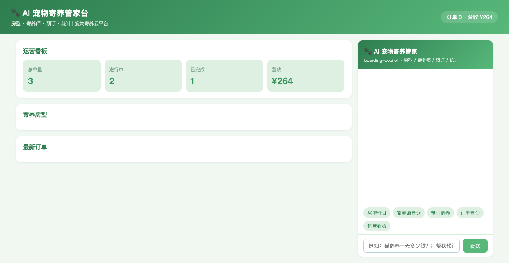
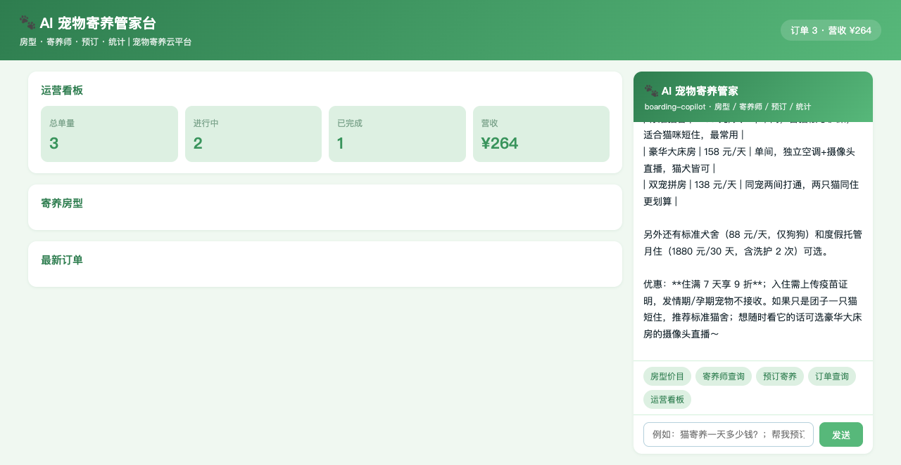
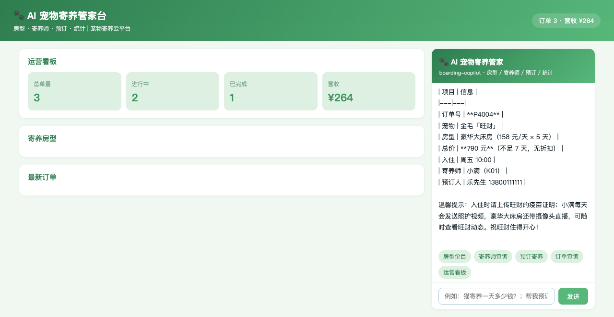
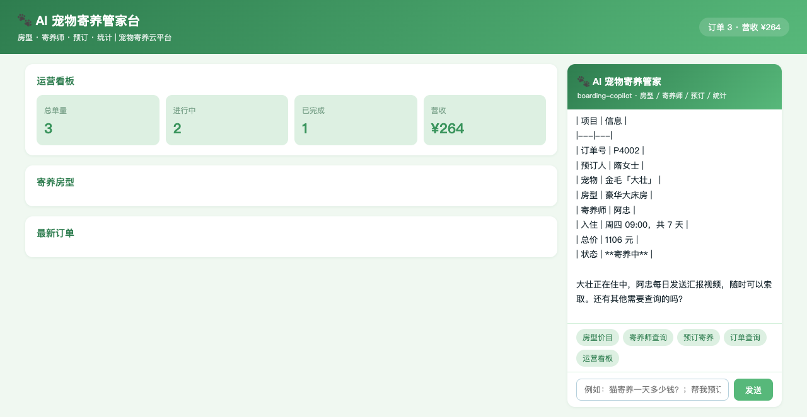
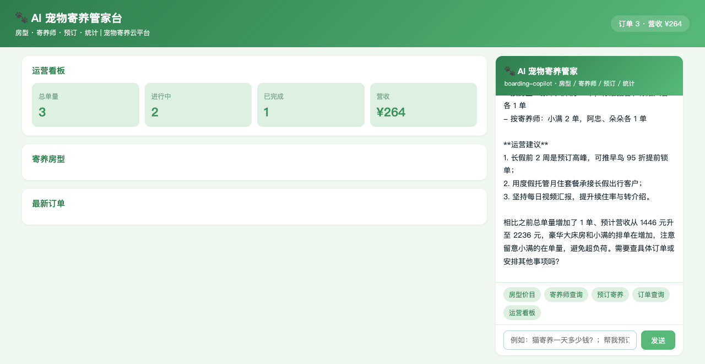

# pet-board · AI 宠物寄养管家（DSH Java Native Plugin 场景案例 P74）

> 基于 [deepseek-harness-java（DSH）](https://github.com/deepseek-harness-java) Java Native Plugin 机制构建的宠物寄养连锁智能管家：房型价目、寄养师查询、预订寄养、订单跟踪、运营统计，一个 Agent 全搞定。

  

## ✨ 功能一览

| 能力 | 说明 |
|------|------|
| 🐾 房型价目 | 5 种房型（标准猫舍 68 / 标准犬舍 88 / 豪华大床房 158 / 双宠拼房 138 / 月住 1880）按天计价 |
| 👩‍🌾 寄养师查询 | 3 位寄养师特长与评分（小满 4.9 / 阿忠 5.0 / 朵朵 4.8）及在单量 |
| 📝 预订寄养 | AI 先复述宠物、房型、天数、总价、日期，经确认后办理，住满 7 天自动 9 折 |
| 📦 订单查询 | 单号查宠物 / 房型 / 寄养师 / 日期 / 金额 / 状态 |
| 📊 运营统计 | 总单量 / 待住夜数 / 营收与预计营收 / 分房型分寄养师分布 / 营销建议 |

## 🖼️ 界面预览

| 截图 | 说明 |
|------|------|
|  | 运营看板首屏：总单量 / 进行中 / 营收 + 寄养房型列表 |
|  | AI 房型咨询：猫寄养房型对比与优惠规则 |
|  | AI 预订寄养：确认后办理（金毛「旺财」豪华房 5 天 ¥790） |
|  | AI 订单查询：P4002 详情（金毛「大壮」寄养中） |
|  | AI 运营统计：待住夜数 / 预计营收 / 营销建议 |

## 🏗️ 项目结构

```
pet-board/
├── pom.xml                 # Maven 聚合工程（p-app + p-plugin）
├── p-app/                  # Spring Boot 业务应用（端口 18113）
│   └── src/main/java/cn/xiaofuge/o/app/
│       ├── BoardingApplication.java # 启动类
│       ├── OStore.java              # 数据中心（房型/寄养师/订单）
│       ├── OController.java         # REST 接口（5 端点）
│       └── AssistantController.java # 页面消息 SSE 代理到 DSH
└── p-plugin/               # DSH Java Native 插件（agentId: boarding-copilot）
    └── src/main/java/cn/xiaofuge/o/plugin/
        └── BoardingPlugin.java      # 5 个 AI 工具 + 系统提示词 + Hook
```

## 🔧 AI 工具集（5 个）

| 工具名 | 功能 | 关键约束 |
|--------|------|----------|
| `room_list` | 房型价目查询 | 单价/说明/优惠规则 |
| `keeper_list` | 寄养师列表 | 姓名/特长/评分/在单量 |
| `book` | 预订寄养 | **必须先复述要素经顾客确认后才能调用**；未指定寄养师默认 K01 小满；住满 7 天自动 9 折 |
| `order_info` | 订单查询 | 宠物/房型/寄养师/日期/金额/状态 |
| `stats` | 运营统计 | 含待住夜数与营销建议 |

## 🚀 快速开始

```bash
# 1. 构建业务应用
mvn clean package -DskipTests

# 2. 启动应用（端口 18113）
SERVER_PORT=18113 java -jar p-app/target/p-app-1.0.0-SNAPSHOT.jar

# 3. 插件 jar 放入 DSH 插件目录
cp p-plugin/target/p-plugin-1.0.0-SNAPSHOT.jar ~/.dsh/standalone/plugins/boarding-copilot.jar

# 4. 注册插件（DSH 运行中）
curl -X POST http://127.0.0.1:8090/api/harness/plugins/install \
  -H 'Content-Type: application/json' \
  -d '{"pluginId":"boarding-copilot","displayName":"AI 宠物寄养管家","pluginVersion":"1.0.0","runtimeType":"JAVA_NATIVE","sourcePath":"'$HOME'/.dsh/standalone/plugins/boarding-copilot.jar","entrypoint":"cn.xiaofuge.o.plugin.BoardingPlugin"}'

# 5. 激活插件
curl -X POST http://127.0.0.1:8090/api/harness/plugins/activate \
  -H 'Content-Type: application/json' -d '{"pluginId":"boarding-copilot"}'

# 6. 启动 DSH standalone（如未运行）
cd ~/.dsh/standalone && java -Dspring.profiles.active=standalone -Dserver.port=8090 \
  -jar ~/.dsh/skills/dsh-java-plugin-skills/runtime/deepseek-harness-java-app.jar
```

打开 **http://127.0.0.1:18113** 即可开始对话。

## 🌐 REST 接口

| 方法 | 路径 | 说明 |
|------|------|------|
| GET | `/api/rooms` | 房型价目列表（含优惠规则） |
| GET | `/api/keepers` | 寄养师列表（含在单量） |
| POST | `/api/book` | 预订寄养 `{customer, phone, pet, room, keeperId, startDate, days}` |
| GET | `/api/order?orderId=` | 订单查询 |
| GET | `/api/stats` | 运营统计 |
| POST | `/api/assistant/stream` | AI 对话 SSE 代理 |

## ✅ E2E 验证（agent_stream.sh 端到端）

| # | 用户消息 | 调用工具 | 结果 |
|---|----------|----------|------|
| 1 | 有哪些寄养房型和价格？ | room_list | ✅ 5 种房型单价 + 优惠 |
| 2 | 有哪些寄养师？ | keeper_list | ✅ 3 位寄养师特长评分 |
| 3 | 帮米女士预订英短蓝猫 8 天（含确认语） | book | ✅ 单号 P4005，9 折 ¥489.6 |
| 4 | 查订单 P4002 | order_info | ✅ 金毛「大壮」/ 寄养中 |
| 5 | 今天运营情况 | stats | ✅ 待住 17 晚 / 预计营收 ¥2236 |

## 🔑 技术要点

- **DSH Java Native Plugin**：`AbstractHarnessPlugin` + `AbstractTool`，工具以 `plugin__boarding-copilot__<name>` 暴露给 LLM
- **系统提示词注入**：`registerSystemPrompt` 固化「预订前必须复述要素确认」「入住需疫苗证明」「发情期/孕期不接收」「每日视频汇报」等业务红线
- **PRE_TOOL_USE Hook**：所有工具调用注入审计上下文
- **SSE 透传**：页面消息经 `AssistantController` 代理到 DSH `/api/agent/stream`（agentId=boarding-copilot，超时 180s）
- **数值参数容错**：`days` 同时兼容 JSON number 与字符串形式（LLM 传参不稳定场景）
- **环境变量配置**：插件经 `BOARDING_APP_BASE_URL`（默认 18113）访问业务应用

## 📄 License

MIT
